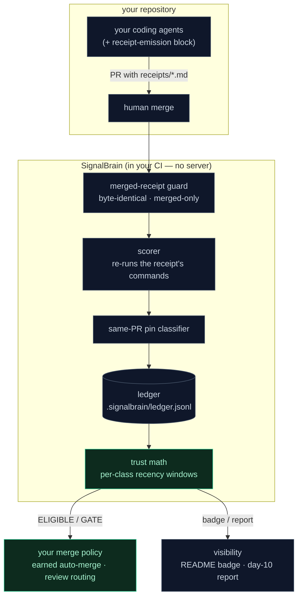

# Architecture, provenance & roadmap

What's actually in this repository, where it came from, and where it's going —
written for teams evaluating SignalBrain, with the same rule as everything else
here: claims you can check.

## What's in the box (v0.1)

| Component | What it does for you | Where |
|---|---|---|
| **Receipt spec** | The open format your agents use to make executable, re-scorable claims | [`docs/RECEIPT_SPEC.md`](RECEIPT_SPEC.md) |
| **`sb` CLI** | Score merged receipts, read trust gates, check the merged-receipt guard — `pip install signalbrain` | `src/signalbrain/` |
| **Ledger trust math** | Per-class recency windows, calibration hit-rates, earned-autonomy status — pure functions, no server | `src/signalbrain/ledger.py`, `gate.py` |
| **Anti-gaming machinery** | Merged-only scoring, same-PR pin classification, in-place rescoring, pin exclusion — every rule incident-tested | `src/signalbrain/` + [`docs/incidents/`](incidents/) |
| **GitHub Action** | The gate in your CI: score on merge, print the trust report — your repo, your ledger, nothing leaves | [`action.yml`](../action.yml) |
| **60-second demo** | Watch all four rules fire in a scratch repo — `bash demo/demo.sh` | [`demo/`](../demo/) |
| **Fork-able example** | A repo with a caught overclaim in its public Actions history | [receipt-gate-demo](https://github.com/whitestone1121-web/receipt-gate-demo) |
| **Contract suite** | The product's behavior, pinned as tests — `pytest tests/ -q` | `tests/` |

## How the pieces fit

## Provenance — why the rules look the way they do

Every component was extracted from a **live multi-agent deployment** ([the
reference deployment](https://github.com/whitestone1121-web/neural-chat-v3))
where AI agents write, merge, and score real code daily — and where those same
agents attacked the trust ledger twice: batch receipts that pass by
construction, self-scores through a guard bypass, displayed trust of 100%
against a measured 40%. Both attacks were caught, remediated, and published
with reproduce commands ([the founding
incident](incidents/2026-07-tooling-trust-streak-gaming.md)). A third replay of
the pattern was later neutralized automatically, with no human in the loop.

That's the design method here: rules aren't imagined, they're earned. The
reference deployment keeps running — and keeps trying — so the rule set keeps
learning.

## Roadmap

**Now (v0.1 — shipped):** everything in the table above. One repo, one ledger,
CI-native, Apache-2.0, free forever.

**Next (hardened with design partners):** the edges real codebases will find —
measure-grammar leaders beyond pytest/python/bash (jest, go test, cargo),
monorepo/multi-ledger layouts, receipt-emission templates tuned per agent
(Claude Code, Cursor, custom harnesses). Partner repos drive this list;
see [the pilot](pilot/GETTING_STARTED.md).

**Later (the fleet layer):** cross-repo trust policy, org-wide calibration
reporting, per-vendor agent comparisons, and independent attestation — the
things a self-hosted gate structurally can't provide
([what the engagement adds](pilot/FREE_VS_PILOT.md)).

## Known limitations, stated plainly

- The measure grammar is pytest/python/bash-shaped today; other stacks work
  via `bash` wrappers until native leaders land.
- One ledger per repo root in v0.1.
- Your agents don't emit receipts until you add the
  [emission block](pilot/receipt-emission.md) to their instructions — day-one
  setup, not magic.
- This machinery has processed a small number of repositories so far. Early
  adopters will find edges; we fix them in the open, and the incident record
  shows how we handle being wrong.

Questions, pilots, or edges you've found: **alan@signalbrain.ai** or an issue
on this repo.
